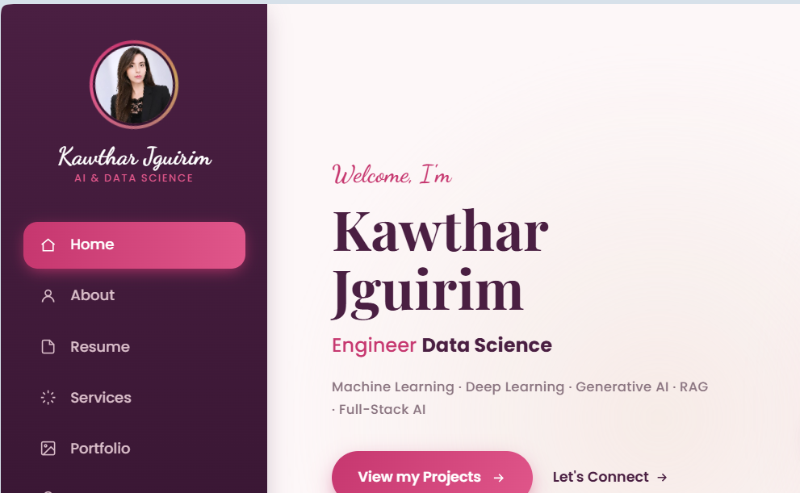

# Kawthar Jguirim — Portfolio

Personal portfolio website of **Kawthar Jguirim**, AI & Data Science Engineer — final-year engineering student at ESPRIT (Tunisia), working across machine learning, deep learning, generative AI (RAG, LLMs), and full-stack development.

🔗 **Live site:** _add your deployed link here (e.g. Vercel / Netlify / GitHub Pages)_



---

## ✨ About

This site presents my background, skills, and projects as an AI/ML and full-stack developer — from data pipelines and deep learning models to production-ready SaaS applications (FastAPI, React/Next.js, Docker).

## 🧩 Sections

- **Home** — animated hero with an interactive tech orbit around my portrait
- **About** — background, education, and a quick personal introduction
- **Skills** — languages, frameworks, and tools I work with (AI/ML, backend, frontend, DevOps)
- **Resume** — education and experience timeline
- **Services** — what I can help with (AI/ML development, full-stack apps, data pipelines)
- **Portfolio** — featured projects, including:
  - **Forge AI (WriteMind AI)** — SaaS technical interview prep platform with a multi-agent architecture
  - **GeniAI** — SaaS chat app with a full RAG module (FastAPI + React/Vite/TypeScript)
  - **Memo** — full-stack "second brain" platform for tech companies (FastAPI + Next.js, RAG, Stripe billing)
  - and more (medical imaging deep learning models, voice assistants, games)
- **Certifications** — badges and credentials
- **Contact** — ways to reach me

## 🎨 Features

- Fully responsive, single-page design
- Custom hero section with parallax mouse-tracking (portrait tilt, orbiting tech icons, particles)
- Scroll-triggered reveal animations on section titles, skills, timeline, and project cards
- Interactive project cards and certification badges
- Respects `prefers-reduced-motion` for accessibility

## 🛠️ Tech Stack

- **HTML5 / CSS3** — semantic markup, custom properties, animations (no CSS framework)
- **Vanilla JavaScript** — IntersectionObserver-driven scroll reveals, interactivity, no build step required

## 🚀 Getting Started

This is a static site — no build tools or dependencies required.

```bash
git clone https://github.com/kawtharjguirim/portfollio.git
cd portfollio
```

Then simply open `index.html` in your browser, or serve it locally:

```bash
# with VS Code
Right-click index.html → "Open with Live Server"

# or with Python
python3 -m http.server 8000
```

## 📁 Project Structure

```
portfollio/
├── assets/               # images, icons, CV
├── CV_Kawthar_LaTeX.pdf  # downloadable resume
├── index.html            # main page
└── styles.css            # all styles
```

## 📬 Contact

Feel free to reach out for collaborations, technical discussions, or project opportunities — see the **Contact** section on the live site.

## 📄 License

This project is personal portfolio content. Feel free to draw inspiration from the code, but please don't reuse the personal content, photos, or CV as your own.
